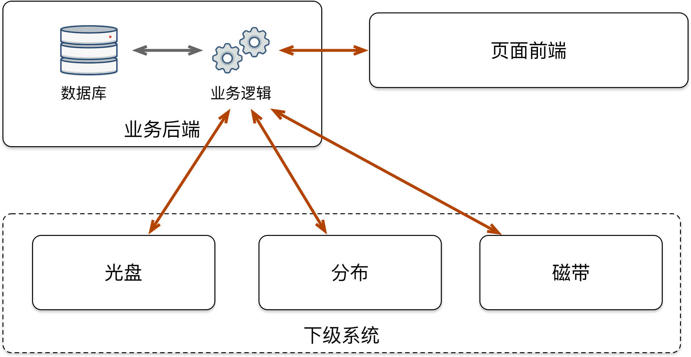

# 1 引言
## 1.1 编写目的

本文档用于介绍紫晶三合一长期存储管理系统的概要设计方案，说明该系统设计开发的背景，明确该系统的总体设计并定义页面前端、业务后端以及下级存储之间的通信接口和通信规范。

## 1.2 定义

* **紫晶三合一长期存储管理系统：** 对紫晶三合一长期存储系统进行管理的前端系统，暂定英文名为 Cold Fusion Storage Manage System，以下简称CFS管理系统；

* **页面前端：** 指运行在浏览器中供用户直接操作的界面系统，以下简称CFS-UI；

* **业务后端：** 指运行在管理服务器上的CFS管理系统的后端，是页面前端与下级存储之间的数据交互桥梁；监控并收集各下级存储系统产生的运行日志与状态信息，并进行加工与存储；在此基础上对页面前端发来的数据请求进行处理并给出正确响应。以下简称CFS-NEXUS；

* **下级存储：** 组成紫晶三合一长期存储的各实际储存系统，主要包括分布式储存，磁带库存储，光盘库存储，以下有必要时分别简称为DIST，TAPE，OPTI。

## 1.4 参考资料

略

# 2 总体设计
## 2.1 需求规定

详见《紫晶三合一存储技术要求》。

## 2.2 运行环镜
根据《紫晶三合一存储技术要求》，整个系统应该在飞腾、龙芯、申威三类国产处理器平台下的Linux环境与X86处理器的Windows环境下均可运行。考虑到系统的兼容性与可移植性，规定系统的运行环境如下：

* **页面前端：** CFS-UI基于Vue.js技术开发，运行在适配HTML 5/CSS 3/ECMAScript 6以上的网页浏览器环境中，兼容主流的FireFox、Chrome浏览器；
* **业务后端：** CFS-NEXUS基于JavaEE技术开发，使用Spring MVC作为基础框架，Spring Boot作为基本运行环境，并依赖必要的常用开源Java运行库，除单点登录为不引入其他第三方依赖；
* **网络互联：** CFS管理系统的管理数据流均基于标准以太网。

## 2.3 基本设计概念和处理流程

CFS管理系统基于标准的前后端分离思想进行设计，将系统中的业务逻辑解耦到页面前端与业务后端中分别进行实现。

* **页面前端**接受用户的输入，并处理必要的简单逻辑，如翻页，选择要显示的对象等；然后从业务后端请求数据，并将数据展示在页面前端上。

* **业务后端**分为“主动数据采集”和“被动数据采集”两个部分：
  * **主动数据采集** 通过定时任务从下级存储系统中采集必要数据，并进行清洗，计算，汇总等处理，然后按需要将数据存储在数据库备查或者主动推送到页面前端；
  * **被动数据采集** 接受页面前端的请求，将请求内容翻译为对下级数据存储系统的数据请求操作，然后立刻执行该操作，并将操作的结果汇总处理后返回给页面前端。

在系统中的页面前端和业务后端之间采用遵循Restful风格的接口，在需要主动推送的数据上使用基于WebSocket的接口。

本设计文档为概要设计文档，在实际开发过程中，采用快速迭代的思想，通过页面的需求进行驱动，持续完善系统业务功能，最终实现功能需求。

## 2.4 结构

CFS管理系统分为三大部分：“页面前端”，“业务后端”和“下级系统”，其中又各自包含若干子模块。其基本结构如图1所示：

图中，业务逻辑与数据库之间的通信为标准数据库接口，业务逻辑与页面前端之间的通信为基于http/https的Restful接口。业务逻辑与下级存储系统之间的接口根据每个下级存储系统的不同而分别进行适配。

# 3 接口设计

## 3.1 用户接口

见《用户界面设计》

## 3.2 外部接口

略

## 3.3 内部接口

见《接口设计文档》

# 5 系统数据结构设计
## 5.1 逻辑结构设计要点

见《数据库设计文档》

## 5.2 物理结构设计要点

见《数据库设计文档》

## 5.3 数据结构与程序的关系

见《数据库设计文档》

# 6 系统出错处理设计
## 6.1 除错信息

略

## 6.2 补救措施

略

## 6.3 系统维护设计

略